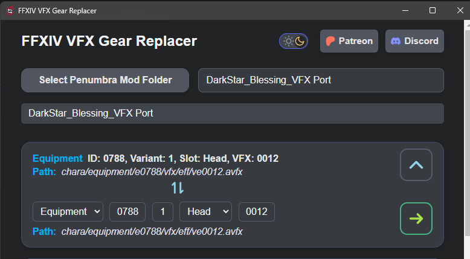

    <h1>FFXIV VFX Port  
	
    </h1>

	
	 
	<a href="https://github.com/ShinoMythmaker/FFXIV-VFX-Port/releases/latest/download/win_installer.exe"><b>Download Installer</b></a> |
	<a href="https://github.com/ShinoMythmaker/FFXIV-VFX-Port/releases/latest/download/win_portable.exe"><b>Download Portable</b></a> |
	<a href="#guide"><b>Guide</b></a>
	 

<i>An app to port visual effects (VFX) from one gear to another within an existing mod in Final Fantasy XIV.</i>

	

## 🤝 Contributing
Contributions, bug reports, and feature requests are welcome! Please open an issue or pull request.

---

*FFXIV VFX Port is not affiliated with Square Enix or Final Fantasy XIV. All trademarks are property of their respective owners.*
